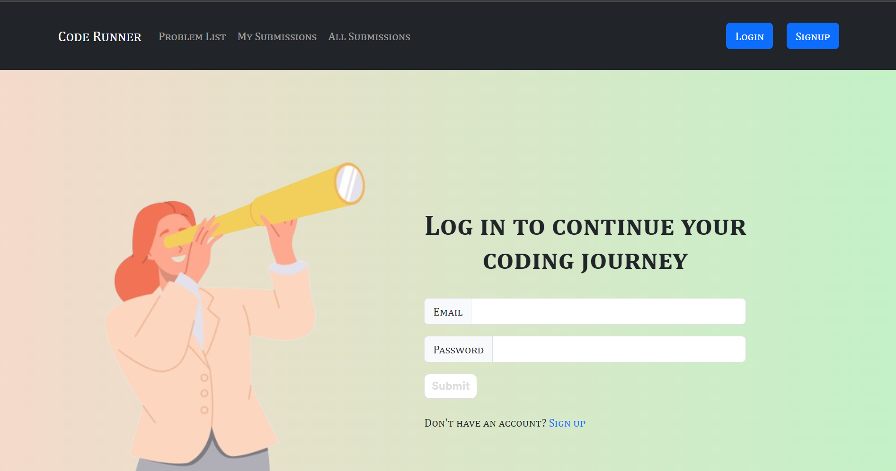
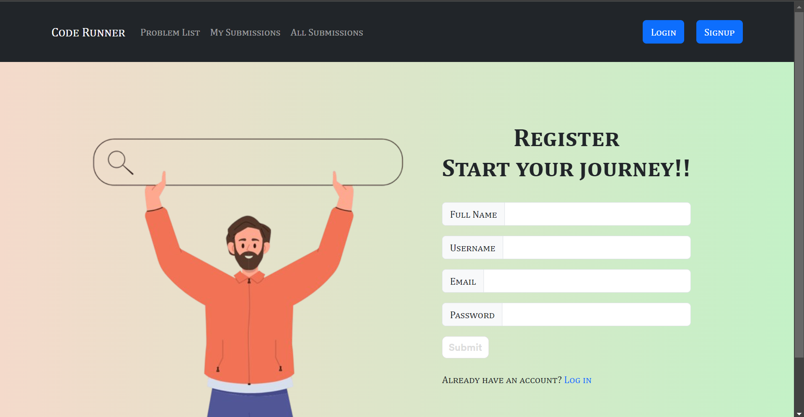
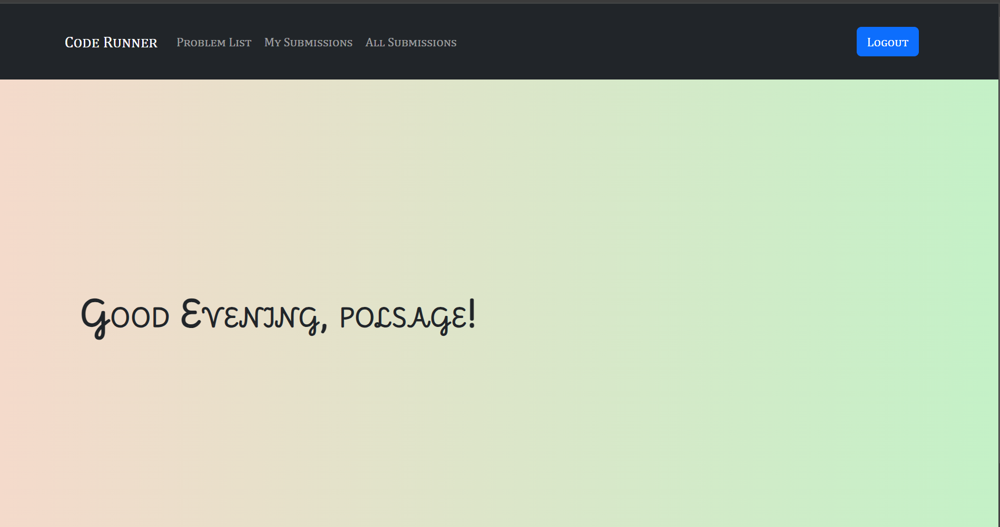
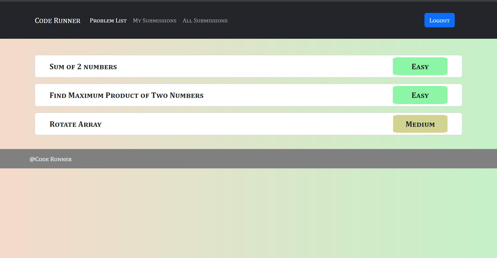
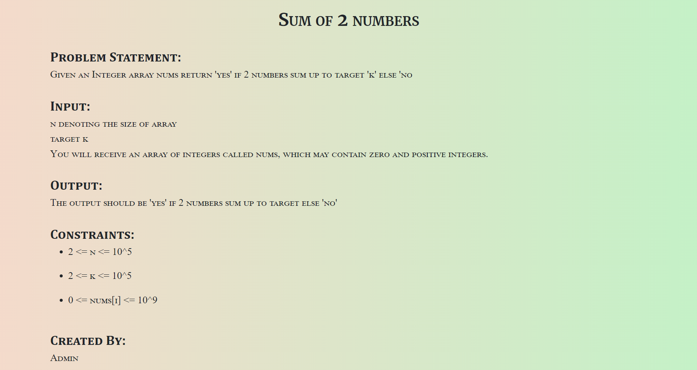
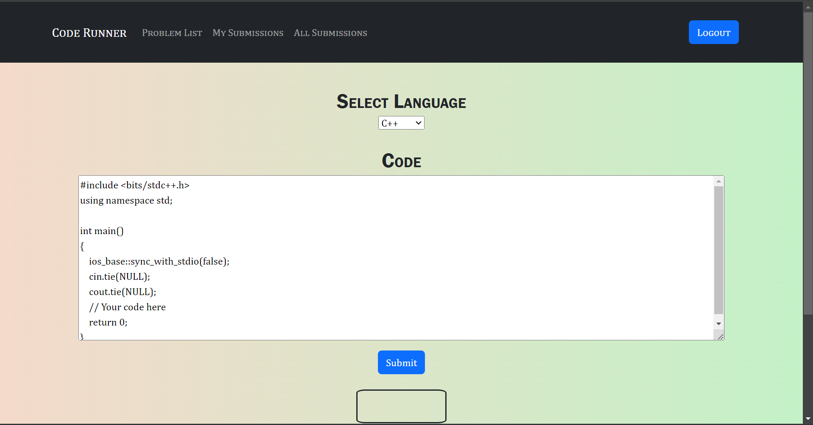

# Dev_Algo

## Deployed Link
[CodeClash](https://dev-algo.vercel.app/)

## Introduction 
Welcome to CodeRunner! This application is designed to help you solve coding problems, practice competitive programming, and track your progress. This README file will guide you through using the app, its features, and how to get started.

## Table of Contents

1. [Introduction](#introduction)
2. [Features](#features)
3. [Contributing](#contributing)

## Features 

### 1. Access Problems
CodeRunner allows you to browse and explore a variety of coding problems across different difficulty levels.

### 2. Read Problem Statements
Each problem includes a detailed problem statement, input/output format, and constraints to help you understand and solve the challenge effectively.

### 3. Submit Solutions in Multiple Languages
You can submit your code in several programming languages, including Python, C++, and Java, and get real-time feedback on your solutions.

## Contributing 
We welcome contributions from the community to improve and enhance the WebApp. If you would like to contribute, please follow these steps:

Fork the repository.
1. Create a new branch for your feature or bug fix.
2. Make your changes and commit them.
3. Push your changes to your fork.
4. Create a pull request to the main repository.
   
Our team will review your pull request, and if accepted, your changes will be incorporated into the WebApp.
